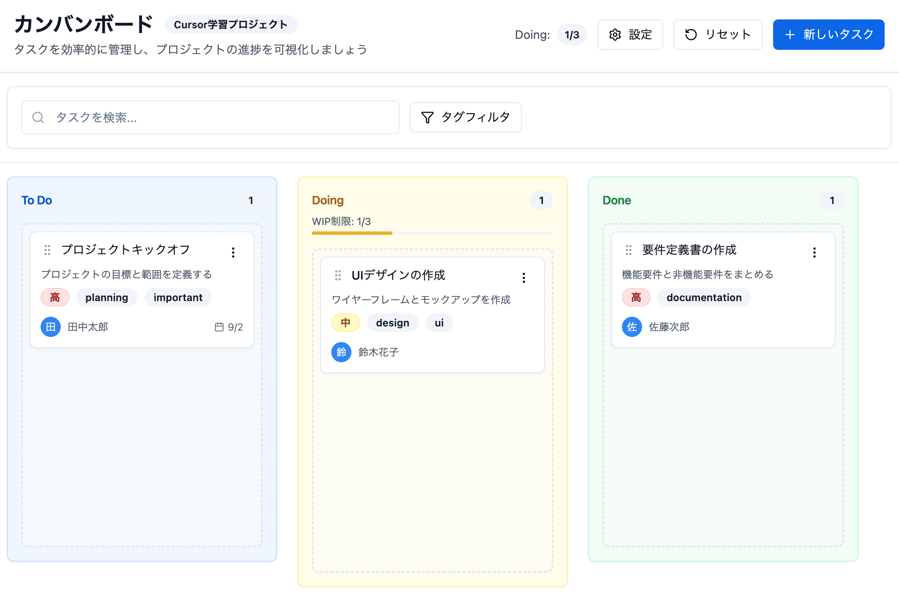

# 🚀 Cursorハンズオン



## 📚 プロジェクト概要

**Cursorの実践的なハンズオンカリキュラム**

このリポジトリは、AI支援開発ツール「Cursor」を効果的に活用するための包括的な学習プログラムです。実際にカンバンボードアプリケーションを構築しながら、CursorのAI機能を段階的に習得できます。

## 🌟 特徴

### 📖 構造化されたカリキュラム
5章構成で、初心者から上級者まで対応：

#### 必須カリキュラム（第1〜4章）
1. **環境構築とセットアップ** - Cursorの基本操作とプロジェクトセットアップ
2. **Agent機能でUI実装** - 自律的なコード生成でUIを構築
3. **Cmd+KとTab補完** - 効率的なコード改善と生成テクニック
4. **AIコードレビュー** - 品質向上のための自動レビュー

#### オプション（第5章）
5. **【オプション】実践テクニック** - トラブルシューティングと応用技術

### 🛠️ 実践的な成果物
完成時には、以下の機能を持つ本格的なカンバンボードが完成：

- ✅ **タスク管理**: 作成・編集・削除・移動
- ✅ **3列構成**: To Do、Doing、Doneのワークフロー
- ✅ **検索機能**: リアルタイムフィルタリング
- ✅ **データ永続化**: ローカルストレージ統合
- ✅ **モダンUI**: Tailwind CSS + shadcn/ui
- ✅ **型安全**: TypeScript完全対応

## 📂 リポジトリ構成

```
cursor03/
├── README.md                 # このファイル
├── TIMETABLE.md             # タイムスケジュール
├── kanban-curriculum/        # カリキュラム本体
│   ├── README.md            # カリキュラム概要
│   ├── PRECHECK.md          # 事前確認事項
│   ├── SPEC.md              # 仕様書
│   ├── chapter1_setup.md    # 第1章: 環境構築
│   ├── chapter2_agent.md    # 第2章: Agent機能
│   ├── chapter3_inline.md   # 第3章: Cmd+K/Tab補完
│   ├── chapter4_review.md   # 第4章: AIレビュー
│   ├── chapter5_practice.md # 第5章: 【オプション】実践
│   └── img/                 # 画像ファイル
└── kanban-board-app/         # 実装プロジェクト
    ├── src/                  # ソースコード
    ├── package.json          # 依存関係
    └── README.md            # アプリ説明書
```

## 📊 カリキュラム構成

| 章 | 内容 | 区分 |
|---|------|------|
| 1 | 環境構築とセットアップ | 必須 |
| 2 | Agent機能でUI実装 | 必須 |
| 3 | Cmd+KとTab補完 | 必須 |
| 4 | AIコードレビュー | 必須 |
| 5 | 実践テクニック | オプション |

