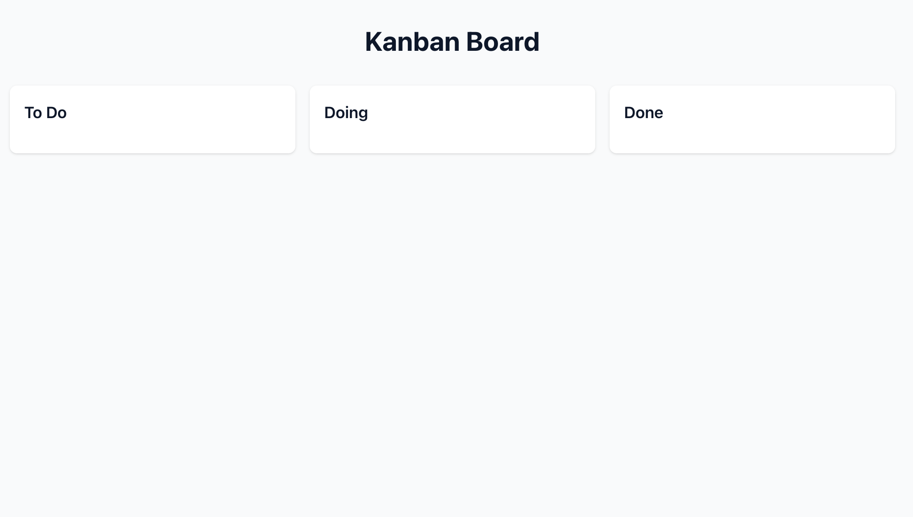

# 第1章: Cursor入門とプロジェクトセットアップ

## 学習目標
- CursorでAIペアプログラミングの基本を理解する
- 主要なショートカットキーの使い方を学ぶ
- AIと協働してReact + Viteプロジェクトをセットアップする

## 1.1 Cursorのインストール

### ダウンロードとインストール
1. [Cursor公式サイト](https://cursor.sh/)からダウンロード
2. OSに応じたインストーラーを実行
3. 初回起動時の設定
   - AIモデルの選択（推奨：Claude 3.5 Sonnet）
   - テーマの選択（お好みで）

## 1.2 基本UI/UXの理解

### 主要なパネル
- **エディタエリア**: コードを編集するメイン領域
- **サイドバー**: ファイルエクスプローラー（Cmd+B / Ctrl+B で表示/非表示）
- **チャット**: AIとの対話（Cmd+L / Ctrl+L）
- **Agent**: 複数ファイル編集・自律的タスク実行（Cmd+I / Ctrl+I）
- **ターミナル**: コマンド実行（Cmd+J / Ctrl+J）

### 重要なショートカットキー

| 機能 | Mac | Windows/Linux | 説明 |
|------|-----|---------------|------|
| インライン編集 | Cmd+K | Ctrl+K | 選択範囲をAIで編集 |
| チャット | Cmd+L | Ctrl+L | AIと対話 |
| Agent | Cmd+I | Ctrl+I | 複数ファイル編集/自律的タスク実行 |
| Tab補完 | Tab | Tab | AI自動補完 |
| サイドバー | Cmd+B | Ctrl+B | ファイル表示/非表示 |
| ターミナル | Cmd+J | Ctrl+J | ターミナルパネル |

## 1.3 プロジェクトの初期設定

### ハンズオン課題1: プロジェクトセットアップ

1. **新規フォルダの作成**
```bash
mkdir kanban-board-cursor
cd kanban-board-cursor
```

2. **Cursorでフォルダを開く**
   - File → Open Folder から作成したフォルダを選択

3. **チャット（Cmd+L）を開いて、以下を入力：**

```
React + Vite + TypeScriptでプロジェクトを初期化してください。
プロジェクト名: kanban-board
以下も設定してください：
- TypeScriptを使用
- package.jsonにnpm scripts追加
- .gitignoreファイル作成
```

**💡 ポイント**: Cursorは指示に従ってコマンドを提案し、実行の承認を求めてきます。内容を確認して「Run」をクリック。

### 期待される実行内容
```bash
npm create vite@latest . -- --template react-ts
npm install
```
### 実行結果イメージ


## 1.4 必要なライブラリの導入

### ハンズオン課題2: フロントエンドライブラリの追加

**チャット（Cmd+L）に以下を入力：**

```
フロントエンドの必要なライブラリをインストールしてください：

1. Tailwind CSS v3（スタイリング） - バージョン3を明示的に指定
2. shadcn/ui（UIコンポーネント）  
3. Framer Motion（アニメーション・ドラッグ&ドロップ）
4. Zustand（状態管理）
5. Lucide React（アイコン）

重要: Tailwind CSSはv3を使用します。以下のコマンドでインストール：
npm install -D tailwindcss@^3.4.0 postcss autoprefixer

必要な設定ファイルの作成と、package.jsonの更新もお願いします。
```

**Cursorが実行する内容の例：**
- 各ライブラリのインストールコマンド
- tailwind.config.jsの作成
- globals.cssへのTailwind追加
- components.jsonの作成（shadcn/ui用）

## 1.5 .cursorrulesファイルの作成

### プロジェクトルールの設定

**.cursorrulesファイルを作成して、以下を記載：**

```text
# Kanban Board Project Rules

## Tech Stack
- Frontend: React 18+ with TypeScript, Vite
- Styling: Tailwind CSS
- UI Components: shadcn/ui
- Drag & Drop: Framer Motion
- State: Zustand with persist (localStorage)

## Code Style
- Functional components only
- TypeScript strict mode
- Tailwind for styling
- Custom hooks for logic
- RESTful API design

## AI Instructions
- Always use TypeScript
- Prefer Tailwind classes over CSS files
- Use shadcn/ui components when available
- Implement proper error handling
- Create API endpoints with Express
- Use proper data validation
```

**💡 ポイント**: このファイルによりCursorが一貫したコードを生成します。

## 1.6 基本的なApp.tsxの作成

### ハンズオン課題3: Tab補完で最初のコンポーネント

1. `src/App.tsx`を開く
2. 既存のコードを全削除
3. Tab補完の使い方：
   - コメントを入力してTabキーで生成
   - **実践的なコツ**: 一度に全部入れようとせず、段階的に補完を活用
     - 例: `f`と入力→Tab→`function`が補完される
     - 改行して`div`と入力→Tab→適切なJSX要素が補完される
     - この繰り返しでコードを構築

```tsx
// Create a simple kanban board layout with three columns: Todo, Doing, Done
// Use Tailwind CSS for styling
```

**Tab補完が生成するコード例：**
```tsx
function App() {
  return (
    <div className="min-h-screen bg-gray-50 p-8">
      <h1 className="text-3xl font-bold text-center mb-8">
        Kanban Board
      </h1>
      <div className="flex gap-4 justify-center">
        <div className="bg-white rounded-lg shadow p-4 w-80">
          <h2 className="font-semibold text-lg mb-4">To Do</h2>
        </div>
        <div className="bg-white rounded-lg shadow p-4 w-80">
          <h2 className="font-semibold text-lg mb-4">Doing</h2>
        </div>
        <div className="bg-white rounded-lg shadow p-4 w-80">
          <h2 className="font-semibold text-lg mb-4">Done</h2>
        </div>
      </div>
    </div>
  )
}

export default App
```

## 1.7 データストアの初期化

### ハンズオン課題4: データストアセットアップ

**チャット（Cmd+L）に以下を入力：**

```
src/store/kanbanStore.tsを作成して、
Zustandストアを初期化してください：

1. cardsとcolumnsのデータ構造を定義
2. 初期データ（3つのカラム）の作成
3. CRUD操作のアクション実装
4. persistミドルウェアでローカルストレージに保存

TypeScriptで型安全に実装してください。
```

## 1.8 開発サーバーの起動

### 動作確認

**開発サーバー起動：**
```bash
npm run dev
```



ブラウザで`http://localhost:5173`を開き、3つのカラムが表示されることを確認。

**次のステップ**: データはローカルストレージに自動保存されるようになっているので、章2以降でその辺りを実装していきます。

## 📝 この章でAIと協働して実現したこと

- ✅ Cursorの基本的な操作方法を体験
- ✅ 主要ショートカット（Cmd+K、Cmd+L、Cmd+I、Tab）の活用
- ✅ AIチャットを使ったプロジェクト初期化
- ✅ .cursorrulesでAIへの指示を最適化
- ✅ Tab補完でAIによるコード生成を体験

## 💡 Tips

### 効果的なCursorの使い方

1. **具体的な指示を出す**
   - ❌ 「UIを作って」
   - ✅ 「Tailwind CSSを使って3カラムのレイアウトを作成」

2. **コンテキストを提供する**
   - ファイルを開いた状態で質問
   - @ファイル名 で特定のファイルを参照

3. **段階的に進める**
   - 一度に多くを要求しない
   - 小さな変更を積み重ねる

## 🚀 次の章へ

第2章では、AgentモードでAIと協働して本格的なかんばんボードを構築していきます。

---

### 課題チェックリスト

- [ ] Cursorのインストール完了
- [ ] プロジェクトの初期化
- [ ] 必要なライブラリの追加
- [ ] .cursorrulesファイルの設定
- [ ] 基本レイアウトの表示確認
- [ ] データストアの初期設定