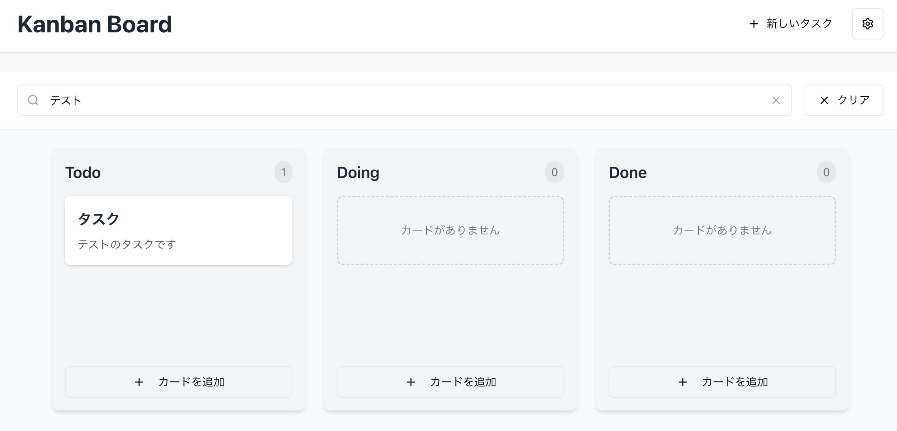

# 第2章: Agent（Cmd+I）でかんばんボードを構築

注意: カリキュラムの調整を行い、2.4が欠番となっております

## 学習目標
- Agent（Cmd+I）でAIと協働して効率的に開発する方法を体験
- AIの自律的なタスク実行でプロジェクト全体を構築
- AIによる複数ファイルの同時作成・編集を体験
- AIによるエラー解決とコード生成を観察

---

## 2.1 Agentモードの基本理解

### Agentとは
- **起動方法**: Cmd+I（Mac）/ Ctrl+I（Windows/Linux）
- **特徴**: 複数ファイルを同時に編集、自律的にタスク実行
- **メリット**: コマンド実行、ファイル作成、エラー対応まで自動化

### このアプローチの利点
1. **高速開発**: 一度の指示で複数の関連ファイルを作成
2. **整合性**: ファイル間の依存関係を自動解決
3. **エラー対応**: 発生したエラーを自動的に修正

## 2.2 基本機能の実装 - 課題

次の機能を実装してください。

- タスクのCRUD (作成・読取・更新・削除)
- タスクのドラッグ&ドロップ (カラム間移動)

### やりかた

Agent（Cmd+I）を開いて、機能の実装の依頼を出してください。

色々と以来の出し方を試してみて、アウトプットが思い通りにならない場合は、Undo(やりなおし)をしてください。  
Undoした場合はチャットは新規に開始してください。

例1: ざっくりとした依頼

```
タスクのCRUD (作成・読取・更新・削除)
タスクのドラッグ&ドロップ (カラム間移動)
```

例2: 具体的で詳細な依頼
```
■ 実装要件

---

### 🟧 ドラッグ＆ドロップ
- HTML5 Drag and Drop API（draggable, onDragStart, onDragOver, onDrop）
  - カードをカラム間で移動可能
- Framer Motionでアニメーション付与
- moveCard関数でストアを更新

---

### 📝 タスクCRUD UI
- **作成**: ダイアログから新規タスク作成（タイトル・説明入力）
- **編集**: カードクリックまたはメニューから編集ダイアログ表示
- **削除**: カードのメニューから削除
- **表示**: カラムごとにカードを一覧表示

---

### 🧩 コンポーネント構成
- **TaskCard.tsx**  
  └ ドラッグ可能なカード（編集・削除用メニュー付き）
- **Column.tsx**  
  └ ドロップゾーン付きカラム
- **TaskDialog.tsx**  
  └ タスク作成・編集用フォームダイアログ
- **App.tsx**  
  └ 全体レイアウトとダイアログの状態管理

---

### 🛠 技術仕様
- HTML5 Drag and Dropによる実装
- Framer Motionでカード移動など各種アニメーション
- shadcn/uiのコンポーネント利用（dialog, button, input, textarea, dropdown-menu等）
- CSSは最小限（Tailwind基本クラス中心）

---

### ⚠️ 注意
- **既存の`kanbanStore.ts`のCard/Column構造は変更しないこと**
- 実装はUI層のみ
```

## 2.3 追加実装 - 課題

次の機能を実装してください

- ヘッダーの追加
- ヘッダーに検索バーの追加
- 検索機能の実装

### やりかた

Agent（Cmd+I）を開いて、機能の実装の依頼を出してください。

例1: ざっくりとした依頼
```
ヘッダーの追加
ヘッダーに検索バーの追加
検索機能の実装
```

例2: 具体的で詳細な依頼
```
■ 追加実装要件

### ヘッダー機能（Header.tsx）
- タイトル「Kanban Board」
- 「新しいタスク」ボタン（全カラム共通でタスク作成）

---

### 検索機能（SearchBar.tsx）
- 検索入力（タイトル・説明でリアルタイム検索）
- 検索クリアボタン

---

### ストア拡張（kanbanStore.ts）
- 状態追加: 
  - `searchQuery: string`
- アクション追加: 
  - `setSearchQuery`
- メソッド追加: 
  - `getFilteredTasks()`　（検索でタスクをフィルタ）

---

### App.tsx の更新
- Header・SearchBarを追加
- フィルタリング済みタスクを表示
- 検索状態を管理

---

### UIコンポーネント追加
- `components/ui/label.tsx`（フォームラベル用。既存であれば不要）

---

### 技術仕様
- 検索はリアルタイム（入力即反映）
- 検索状態はlocalStorageに保存（Zustand persist利用）
- CSSはTailwind基本クラスで最小限
- ※ 既存のCard構造は変更せず、検索機能のみ追加
```




## 📝 この章で学んだこと

### AIと協働して実現したこと
- ✅ Agentモードを使った高速開発の体験
- ✅ AIによる複数ファイルの同時作成・編集
- ✅ 基本的なかんばんボードの構築


### Agentが得意なタスク

- プロジェクトの初期構築
- 複数ファイルにまたがる機能実装
- ライブラリの導入と設定
- エラーの一括修正
- リファクタリング

## 🎯 チャレンジ課題

(すべてのチャプターが終わって余裕がある方は、以下を実装してみましょう。)

Agentモードで以下を実装してみましょう：

1. タグ機能
2. 重要度機能
3. 期限日機能

## 🚀 次の章へ

第3章では、Cmd+KでAIと協働してコードを洗練させ、細かい調整を行います。
