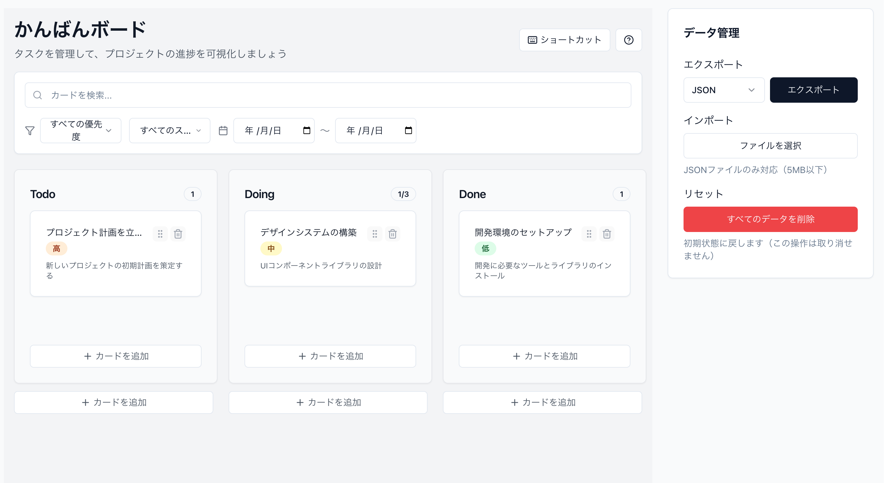

# 第2章: Agent（Cmd+I）でかんばんボードを構築

注意: カリキュラムの調整を行い、2.4が欠番となっております

## 学習目標
- Agent（Cmd+I）でAIと協働して効率的に開発する方法を体験
- AIの自律的なタスク実行でプロジェクト全体を構築
- AIによる複数ファイルの同時作成・編集を体験
- AIによるエラー解決とコード生成を観察

## ⚡ この章の進め方

### 📌 必須課題（2.1~2.3）
基本的なかんばんボードを構築します。これだけでチャプター3以降の学習が可能です。
- **達成目標**: 動作する最小限のかんばんボード（データはlocalStorageに自動保存）

### 🎯 オプション課題（2.5～2.7）
時間に余裕がある方、より高度な機能に挑戦したい方向けの発展課題です。
- **注意**: スキップしても後続の章に影響はありません

---

## 2.1 Agentモードの基本理解

### Agentとは
- **起動方法**: Cmd+I（Mac）/ Ctrl+I（Windows/Linux）
- **特徴**: 複数ファイルを同時に編集、自律的にタスク実行
- **メリット**: コマンド実行、ファイル作成、エラー対応まで自動化

### このアプローチの利点
1. **高速開発**: 一度の指示で複数の関連ファイルを作成
2. **整合性**: ファイル間の依存関係を自動解決
3. **エラー対応**: 発生したエラーを自動的に修正

## 2.2 基本機能の実装

**Agent（Cmd+I）を開いて、以下を入力：**

```
■ 実装要件（見やすく箇条書き）

---

### 🟧 ドラッグ＆ドロップ
- HTML5 Drag and Drop API（draggable, onDragStart, onDragOver, onDrop）
  - カードをカラム間で移動可能
- Framer Motionでアニメーション付与
- moveCard関数でストアを更新

---

### 📝 タスクCRUD UI
- **作成**: ダイアログから新規タスク作成（タイトル・説明入力）
- **編集**: カードクリックまたはメニューから編集ダイアログ表示
- **削除**: カードのメニューから削除
- **表示**: カラムごとにカードを一覧表示

---

### 🧩 コンポーネント構成
- **TaskCard.tsx**  
  └ ドラッグ可能なカード（編集・削除用メニュー付き）
- **Column.tsx**  
  └ ドロップゾーン付きカラム
- **TaskDialog.tsx**  
  └ タスク作成・編集用フォームダイアログ
- **App.tsx**  
  └ 全体レイアウトとダイアログの状態管理

---

### 🛠 技術仕様
- HTML5 Drag and Dropによる実装
- Framer Motionでカード移動など各種アニメーション
- shadcn/uiのコンポーネント利用（dialog, button, input, textarea, dropdown-menu等）
- CSSは最小限（Tailwind基本クラス中心）

---

### ⚠️ 注意
- **既存の`kanbanStore.ts`のCard/Column構造は変更しないこと**
- 実装はUI層のみ
```

## 2.3 追加実装要件

**Agent（Cmd+I）を開いて、以下を入力：**

```
■ 追加実装要件（見やすく箇条書き）

### ヘッダー機能（Header.tsx）
- タイトル「Kanban Board」
- 「新しいタスク」ボタン（全カラム共通でタスク作成）
- ボードリセットボタン（確認ダイアログ付き）
- 設定ボタン（WIP制限設定など、必要なら）

---

### 検索・フィルタ機能（SearchBar.tsx）
- 検索入力（タイトル・説明でリアルタイム検索）
- タグフィルタ（Popoverでタグを複数選択可能）
- フィルタクリアボタン
- アクティブフィルタの表示

---

### ストア拡張（kanbanStore.ts）
- 状態追加: 
  - `searchQuery: string`
  - `selectedTags: string[]`
- アクション追加: 
  - `setSearchQuery`
  - `setSelectedTags`
- メソッド追加: 
  - `getFilteredTasks()`　（検索・タグでタスクをフィルタ）
  - `getAllTags()`（全タスクからタグ一覧抽出）

---

### App.tsx の更新
- Header・SearchBarを追加
- フィルタリング済みタスクを表示
- 検索・フィルタの状態を管理

---

### UIコンポーネント追加
- `components/ui/popover.tsx`（タグフィルタ用）
- `components/ui/label.tsx`（フォームラベル用。既存であれば不要）

---

### 技術仕様
- 検索はリアルタイム（入力即反映）
- タグは複数選択可能
- フィルタ状態はlocalStorageに保存（Zustand persist利用）
- CSSはTailwind基本クラスで最小限
- ※ 既存のCard構造は変更せず、検索・フィルタ機能のみ追加
```


---

## 🎯 オプション課題セクション

**以下の2.5～2.7は発展的な内容です。時間がない場合はスキップして第3章へ進んでください。**

---

## 2.5 エクスポート/インポート機能【オプション】

### ハンズオン課題4: データのバックアップ機能

**Agent（Cmd+I）で依頼：**

```
データのエクスポート/インポート機能を追加してください：

1. src/utils/dataManager.ts を作成
   - JSONエクスポート（ダウンロード機能）
   - JSONインポート（ファイルアップロード）
   - CSVエクスポート機能
   - データ検証とサニタイズ

2. src/components/DataControls.tsx を作成
   - エクスポートボタン（JSON/CSV選択）
   - インポートボタン（ファイル選択）
   - データリセットボタン
   - 成功/エラーのトースト表示

3. src/hooks/useAutoSave.ts を作成
   - 自動保存の実装（デバウンス付き）
   - ローカルストレージの容量チェック
   - 保存失敗時の再試行ロジック

4. App.tsx を更新
   - DataControlsコンポーネントの追加
   - useAutoSaveフックの使用

エラーハンドリングとユーザーフィードバックも含めて実装してください。
```


## 2.6 高度な機能の追加【オプション】

### ハンズオン課題5: UX改善と機能拡張

**Agent（Cmd+I）で総仕上げ：**

```
かんばんボードに以下の機能を追加してください：

【検索とフィルタリング】
1. src/components/SearchBar.tsx
   - リアルタイム検索
   - 優先度フィルター
   - 日付範囲フィルター

2. src/store/kanbanStore.ts に追加
   - 検索クエリの管理
   - フィルタリング済みカードの取得

【キーボードショートカット】
3. src/hooks/useKeyboardShortcuts.ts
   - N: 新規カード追加
   - Delete: 選択カードを削除
   - ←→: カード間移動
   - Cmd+Z: 取り消し

【アクセシビリティ】
4. すべてのコンポーネントに追加
   - ARIA属性
   - フォーカス管理
   - スクリーンリーダー対応

【パフォーマンス最適化】
5. React.memo、useMemo、useCallbackの適用
   - 不要な再レンダリング防止
   - 大量カード時の最適化

npm run devで動作確認し、問題があれば修正してください。
```



## 2.7 スタイリングとアニメーションの洗練【オプション】

### ハンズオン課題6: ビジュアル面の完成

**Agent（Cmd+I）で依頼：**

```
UIの見た目とアニメーションを洗練させてください：

1. Tailwind CSSでダークモード対応
   - src/components/ThemeToggle.tsx を作成
   - システム設定に連動
   - スムーズな切り替えアニメーション

2. Framer Motionでマイクロインタラクション追加
   - カードホバー時のスケール
   - 追加/削除時のアニメーション
   - ドラッグ中のゴースト表示

3. ローディング状態とエラー状態のUI
   - src/components/LoadingSpinner.tsx
   - src/components/ErrorBoundary.tsx
   - 空状態の表示

4. レスポンシブデザインの最適化
   - モバイル用レイアウト（縦スクロール）
   - タブレット用レイアウト
   - デスクトップ用レイアウト

すべて実装し、各デバイスサイズで確認してください。
```

## 📝 この章で学んだこと

### 必須課題（2.1～2.3）でAIと協働して実現したこと
- ✅ Agentモードを使った高速開発の体験
- ✅ AIによる複数ファイルの同時作成・編集
- ✅ 基本的なかんばんボードの構築

### オプション課題（2.5～2.7）でAIに実装してもらえる機能
- ✅ データのエクスポート/インポート機能
- ✅ 検索・フィルター・キーボードショートカット
- ✅ ダークモード・アニメーション強化

## 💡 Agentモード活用のコツ

### 効果的な指示の出し方

1. **包括的な要件を一度に伝える**
```
❌ 「カードコンポーネントを作って」→「次にカラムを...」
✅ 「カード、カラム、ボードコンポーネントを一括作成」
```

2. **ファイルパスを明確に指定**
```
src/components/Card/KanbanCard.tsx のように具体的に
```

3. **期待する結果を明記**
```
「動作確認まで行い、エラーがあれば修正」
```

### Agentが得意なタスク

- プロジェクトの初期構築
- 複数ファイルにまたがる機能実装
- ライブラリの導入と設定
- エラーの一括修正
- リファクタリング

## 🎯 チャレンジ課題

Agentモードで以下を実装してみましょう：

1. タスクの期限管理機能
2. ユーザーアサイン機能
3. カテゴリー/タグ機能
4. 統計ダッシュボード

## 🚀 次の章へ

第3章では、Cmd+KでAIと協働してコードを洗練させ、細かい調整を行います。

---

### 課題チェックリスト

- [ ] 型定義とストアの作成
- [ ] UIコンポーネント一式の生成
- [ ] ドラッグ&ドロップ実装
- [ ] データ永続化機能
- [ ] 検索・フィルタリング機能
- [ ] アクセシビリティ対応
- [ ] ダークモード実装