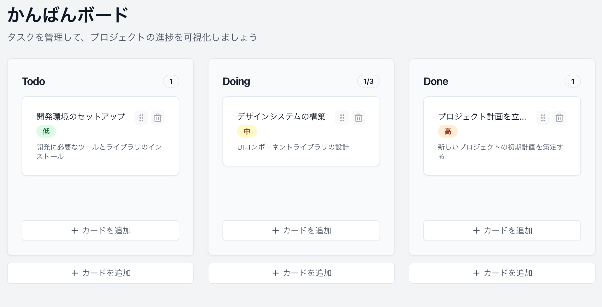
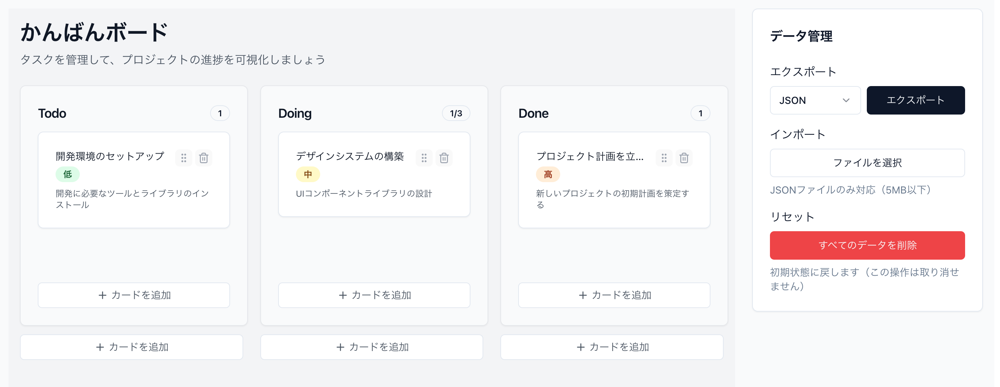

# 第2章: Agent（Cmd+I）でかんばんボードを構築

## 学習目標
- Agent（Cmd+I）のAgentモードで効率的に開発する方法を習得
- 自律的なタスク実行でプロジェクト全体を構築
- 複数ファイルの同時作成・編集を体験
- エラーの自動解決とコード生成

## 2.1 Agentモードの基本理解

### Agentとは
- **起動方法**: Cmd+I（Mac）/ Ctrl+I（Windows/Linux）
- **特徴**: 複数ファイルを同時に編集、自律的にタスク実行
- **メリット**: コマンド実行、ファイル作成、エラー対応まで自動化

### このアプローチの利点
1. **高速開発**: 一度の指示で複数の関連ファイルを作成
2. **整合性**: ファイル間の依存関係を自動解決
3. **エラー対応**: 発生したエラーを自動的に修正

## 2.2 型定義とストア構造の構築

### ハンズオン課題1: プロジェクト基盤の作成

**Agent（Cmd+I）を開いて、以下を入力：**

```
かんばんボードの基盤を作成してください：

1. src/types/kanban.ts に型定義を作成
   - Card: id, title, description, status, priority, createdAt, updatedAt
   - Column: id, title, cards配列, wipLimit
   - Board: columns配列

2. src/store/kanbanStore.ts にZustandストアを作成
   - persistミドルウェアでlocalStorageに永続化
   - カードのCRUD操作
   - ドラッグ&ドロップによる移動
   - WIPリミットの管理

3. src/utils/storage.ts にストレージユーティリティを作成
   - データのエクスポート/インポート
   - バージョン管理とマイグレーション
   - エラーハンドリング

すべてTypeScriptで型安全に実装してください。
```

**Agentが実行する内容：**
- 3つのファイルを同時に作成
- 相互の依存関係を考慮した実装
- 型定義の一貫性を保証

## 2.3 UIコンポーネント一式の作成

### ハンズオン課題2: コンポーネント群の一括生成

**Agent（Cmd+I）で以下を依頼：**

```
shadcn/uiを使ってかんばんボードのUIコンポーネントを作成してください：

【必要なshadcn/uiコンポーネント】
- Card, Button, Input, Badge, Dialog, Select, Textarea

【作成するコンポーネント】
1. src/components/Card/KanbanCard.tsx
   - カード表示（タイトル、説明、優先度バッジ）
   - 削除ボタン（Trash2アイコン）
   - ドラッグハンドル（GripVerticalアイコン）

2. src/components/Column/KanbanColumn.tsx
   - カラムヘッダー（タイトル、カード数/WIPリミット）
   - カードリスト表示
   - 新規カード追加ボタン

3. src/components/Board/Board.tsx
   - 3カラムレイアウト（Todo, Doing, Done）
   - Zustandストアとの連携
   - レスポンシブデザイン

4. src/components/AddCardDialog.tsx
   - カード追加フォーム（Dialog使用）
   - タイトル、説明、優先度の入力
   - バリデーション付き

必要なライブラリのインストールも自動実行してください。
```

**💡 ポイント**: Agentは必要なnpmコマンドも自動で実行します

## 2.4 ドラッグ&ドロップ機能の実装

### ハンズオン課題3: Framer Motionでドラッグ&ドロップ

**Agent（Cmd+I）で実装：**

```
Framer Motionを使ってドラッグ&ドロップ機能を実装してください：

1. framer-motionをインストール

2. src/components/Card/KanbanCard.tsx を更新
   - motion.divでラップ
   - drag="true"とlayoutId設定
   - ドラッグ中のスタイル変更

3. src/components/Column/KanbanColumn.tsx を更新
   - ドロップゾーンの実装
   - AnimatePresenceでアニメーション

4. src/store/kanbanStore.ts を更新
   - moveCardアクションの実装
   - カラム間の移動ロジック
   - WIPリミットのチェック

5. src/components/Board/Board.tsx を更新
   - LayoutGroupでアニメーション管理
   - ドラッグ&ドロップのハンドラー実装

すべてのファイルを更新し、動作確認まで行ってください。
```



## 2.5 データ永続化とエクスポート/インポート

### ハンズオン課題4: 完全なデータ管理システム

**Agent（Cmd+I）で依頼：**

```
データ永続化とバックアップ機能を完成させてください：

1. src/utils/dataManager.ts を作成
   - JSONエクスポート（ダウンロード機能）
   - JSONインポート（ファイルアップロード）
   - CSVエクスポート機能
   - データ検証とサニタイズ

2. src/components/DataControls.tsx を作成
   - エクスポートボタン（JSON/CSV選択）
   - インポートボタン（ファイル選択）
   - データリセットボタン
   - 成功/エラーのトースト表示

3. src/hooks/useAutoSave.ts を作成
   - 自動保存の実装（デバウンス付き）
   - ローカルストレージの容量チェック
   - 保存失敗時の再試行ロジック

4. App.tsx を更新
   - DataControlsコンポーネントの追加
   - useAutoSaveフックの使用

エラーハンドリングとユーザーフィードバックも含めて実装してください。
```



## 2.6 高度な機能の追加

### ハンズオン課題5: UX改善と機能拡張

**Agent（Cmd+I）で総仕上げ：**

```
かんばんボードに以下の機能を追加してください：

【検索とフィルタリング】
1. src/components/SearchBar.tsx
   - リアルタイム検索
   - 優先度フィルター
   - 日付範囲フィルター

2. src/store/kanbanStore.ts に追加
   - 検索クエリの管理
   - フィルタリング済みカードの取得

【キーボードショートカット】
3. src/hooks/useKeyboardShortcuts.ts
   - N: 新規カード追加
   - Delete: 選択カードを削除
   - ←→: カード間移動
   - Cmd+Z: 取り消し

【アクセシビリティ】
4. すべてのコンポーネントに追加
   - ARIA属性
   - フォーカス管理
   - スクリーンリーダー対応

【パフォーマンス最適化】
5. React.memo、useMemo、useCallbackの適用
   - 不要な再レンダリング防止
   - 大量カード時の最適化

npm run devで動作確認し、問題があれば修正してください。
```

## 2.7 スタイリングとアニメーションの洗練

### ハンズオン課題6: ビジュアル面の完成

**Agent（Cmd+I）で依頼：**

```
UIの見た目とアニメーションを洗練させてください：

1. Tailwind CSSでダークモード対応
   - src/components/ThemeToggle.tsx を作成
   - システム設定に連動
   - スムーズな切り替えアニメーション

2. Framer Motionでマイクロインタラクション追加
   - カードホバー時のスケール
   - 追加/削除時のアニメーション
   - ドラッグ中のゴースト表示

3. ローディング状態とエラー状態のUI
   - src/components/LoadingSpinner.tsx
   - src/components/ErrorBoundary.tsx
   - 空状態の表示

4. レスポンシブデザインの最適化
   - モバイル用レイアウト（縦スクロール）
   - タブレット用レイアウト
   - デスクトップ用レイアウト

すべて実装し、各デバイスサイズで確認してください。
```

## 📝 この章で学んだこと

- ✅ Agentモードによる高速開発
- ✅ 複数ファイルの同時作成・編集
- ✅ 自律的なエラー解決
- ✅ npmコマンドの自動実行
- ✅ プロジェクト全体の一括構築

## 💡 Agentモード活用のコツ

### 効果的な指示の出し方

1. **包括的な要件を一度に伝える**
```
❌ 「カードコンポーネントを作って」→「次にカラムを...」
✅ 「カード、カラム、ボードコンポーネントを一括作成」
```

2. **ファイルパスを明確に指定**
```
src/components/Card/KanbanCard.tsx のように具体的に
```

3. **期待する結果を明記**
```
「動作確認まで行い、エラーがあれば修正」
```

### Agentが得意なタスク

- プロジェクトの初期構築
- 複数ファイルにまたがる機能実装
- ライブラリの導入と設定
- エラーの一括修正
- リファクタリング

## 🎯 チャレンジ課題

Agentモードで以下を実装してみましょう：

1. タスクの期限管理機能
2. ユーザーアサイン機能
3. カテゴリー/タグ機能
4. 統計ダッシュボード

## 🚀 次の章へ

第3章では、Cmd+Kを使って作成したコードを洗練させ、細かい調整を行います。

---

### 課題チェックリスト

- [ ] 型定義とストアの作成
- [ ] UIコンポーネント一式の生成
- [ ] ドラッグ&ドロップ実装
- [ ] データ永続化機能
- [ ] 検索・フィルタリング機能
- [ ] アクセシビリティ対応
- [ ] ダークモード実装